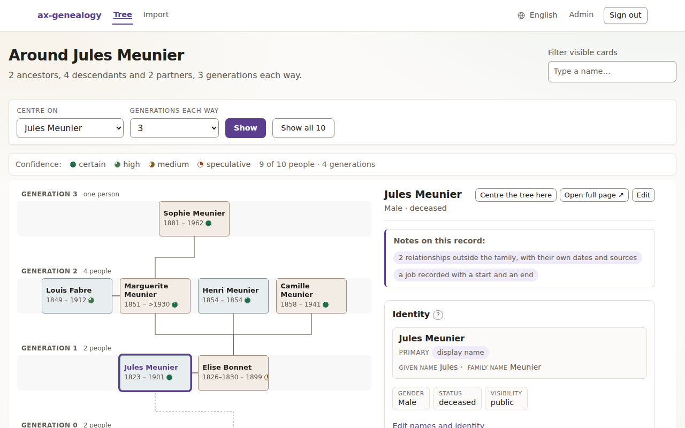
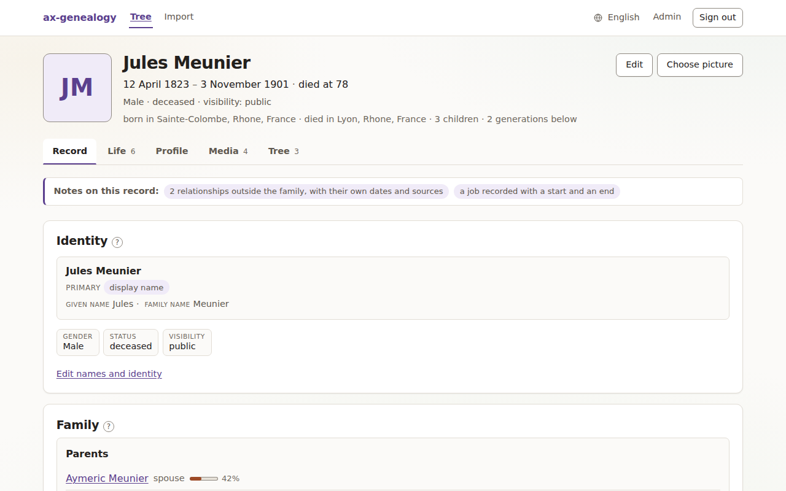

# axgf-cms

A private website for your family tree, run on your own server. The whole
family — people, relationships, scanned certificates and photographs — lives
in one file you own, and relatives sign in to read it or to correct it, each
with the powers you give them. Every change records who made it, how sure
each fact is stays visible, and living relatives can be hidden from visitors
while their great-grandparents are open to anyone.

*(The site calls itself **ax-genealogy**; the repository, the binary, the
service and its system user are all `axgf-cms`.)*

**Who this is for.** Someone in the family who is comfortable running a Linux
server — a VPS or a machine at home — and wants to host the tree for everybody
else. That is who most of this page is for. **If you have been sent a `.axgf`
file and just want to look at it, skip to
[Opening a `.axgf` file on your own computer](#opening-a-axgf-file-on-your-own-computer).**

| The tree around one person | One person's record |
|---|---|
| [](docs/screenshots/tree.png) | [](docs/screenshots/person.png) |

*Both show the demonstration family that `--with-sample` installs.*

---

## Install

On a fresh Ubuntu LTS server, as a user who can `sudo`:

```sh
curl -fsSL https://raw.githubusercontent.com/plkarin/axgf-cms/main/deploy/bootstrap.sh \
  | sudo bash -s -- --version v0.1.0-rc1 --with-sample
```

> **Why `--version`, for now:** no stable release has been published yet —
> only the release candidate `v0.1.0-rc1`, from 31 August 2026 — and without
> `--version` the script asks for the latest *stable* release, finds none, and
> stops with a message saying exactly that. `v0.1.0-rc1` predates the extended
> person profile (the **Profile** tab), and **it cannot open a family file
> that uses the profile**: it reads AXGF 1.0 only, and refuses a 1.1 file with
> `unsupported AXGF spec version "1.1"`. That is fine for a new, empty site; to
> serve an existing 1.1 file, or to have what is on `main`, use `--from-source`
> instead, which needs `cargo` on root's `PATH`. Once a stable release exists,
> the command above works without `--version`.

`--with-sample` seeds the small demonstration family in the screenshots, so a
fresh install has something to look at. Leave it out to start with an empty
tree. At the end the script prints the address, an administrator's username
and password, and the emergency token — **once**. Keep them.

### What the installer does

Read it first if you like: [`deploy/bootstrap.sh`](deploy/bootstrap.sh). Add
`--dry-run` and it prints every step without changing anything. In order, it:

1. Checks the machine's architecture (x86-64 or ARM64).
2. Downloads the release binary and its `.sha256`, refuses to go on if the
   checksum does not match, and installs it as `/usr/local/bin/axgf-cms`.
   (`--from-source` clones this repository and builds it instead.)
3. Creates a system user `axgf-cms` with no login shell.
4. Creates `/var/lib/axgf-cms` for the data, owned by that user.
5. Writes the settings, including a generated emergency token, to
   `/etc/axgf-cms/env`, readable only by root and the service (`0640`).
6. Creates the family file — empty, or the demonstration family.
7. Creates the first administrator account and generates its password.
8. Installs and starts three systemd units: the service itself (sandboxed,
   bound to `127.0.0.1:8080`), a **daily backup** at 03:30, and a **weekly
   check** that reads the data and the newest backup back in full.
9. Waits until the service answers `/health` with the family's data readable,
   then prints what you need to sign in.

Run it again at any time: it will not overwrite your family file, your
accounts or your token. `--uninstall` removes the service and the binary and
**never** the data.

---

## Running it

It is an ordinary systemd service:

```sh
systemctl status axgf-cms           # is it up, what is it serving, when was the last backup
sudo systemctl restart axgf-cms     # after editing /etc/axgf-cms/env
sudo systemctl stop axgf-cms        # finishes any save in progress first
journalctl -u axgf-cms -f           # what it is doing
systemctl list-timers 'axgf-cms*'   # when the next backup and check run
```

Relatives get their accounts from **Admin → Accounts**; there is no
self-registration. [docs/FAMILY.md](docs/FAMILY.md) is a guide you can send
them. Everything else an operator needs is in
[docs/OPERATOR.md](docs/OPERATOR.md).

## Where your data lives

```
/var/lib/axgf-cms/
  family.axgf        the family — the only file that matters
  family.acl         the accounts (password hashes), mode 600
  family.journal     who changed what, and when
  backups/           the daily archives
  .axgf-cms-cache/   photographs unpacked for serving; rebuilt if deleted
```

**The whole family is `family.axgf`**: every person, relationship, date,
source, scanned certificate and photograph, in one file. It is an ordinary ZIP
of JSON files with the attachments inside, so you can copy it, keep it on a
USB stick, or open it with any unzip tool, with or without this program. It is
yours: **Admin → Export** downloads it at any time.

The accounts and the edit history are deliberately *not* inside it. The family
file is made to be copied and sent to people; password hashes and a record of
who corrected what are not.

## Security: it listens on localhost only

**The service binds `127.0.0.1` and must stay there.** It speaks plain HTTP.
Exposed directly — `--bind 0.0.0.0` with nothing in front of it — every
password typed into the sign-in form crosses the network in clear text and a
family's private records are readable by anyone who can reach the port.

To put it on the internet, keep it on localhost and put a reverse proxy in
front that terminates TLS. Two configurations ship in
[`deploy/proxy/`](deploy/proxy/), each tested in front of a live instance:

- [`Caddyfile`](deploy/proxy/Caddyfile) — Caddy obtains and renews the
  certificate itself. Replace the site name and the email, copy it to
  `/etc/caddy/Caddyfile`, reload Caddy.
- [`nginx-axgf-cms.conf`](deploy/proxy/nginx-axgf-cms.conf) — for nginx with a
  certificate from certbot.

Both set the `X-Forwarded-Proto` header that makes the session cookie `Secure`,
allow uploads up to the application's own limit, and wait long enough for a
large save. [docs/OPERATOR.md](docs/OPERATOR.md#publishing-it-tls-and-a-reverse-proxy)
has the details.

**Before you publish a tree imported from GEDCOM:** GEDCOM records no privacy
settings, so an imported tree has none. Until you set them person by person,
anyone recorded as living is shown only to signed-in relatives and everybody
else is public. Check that is what you want.

## Backup and restore

Backups happen on their own: one verified archive a day, kept as 7 daily,
4 weekly and 12 monthly, in `/var/lib/axgf-cms/backups/`. Each is a plain ZIP
holding the family file, the accounts and the edit history, and is read back
in full before it is kept. To back up right now:

```sh
sudo systemctl start axgf-cms-backup.service
```

**A backup on the same disk does not survive that disk.** Copy the archives
somewhere else, for example nightly with
`rsync -a /var/lib/axgf-cms/backups/ backup@othermachine:/srv/axgf/`.

To restore, stop the service and give it an archive. What is there now is
moved aside, not deleted:

```sh
sudo systemctl stop axgf-cms
sudo -u axgf-cms axgf-cms restore --bundle /var/lib/axgf-cms/family.axgf \
  /var/lib/axgf-cms/backups/axgf-backup-20260923T200223Z.zip
sudo systemctl start axgf-cms
```

## Upgrade

```sh
curl -fsSL https://raw.githubusercontent.com/plkarin/axgf-cms/main/deploy/bootstrap.sh \
  | sudo bash -s -- --upgrade --version <tag>
```

It backs up first, keeps the working binary aside, installs the new one,
restarts, and checks that the family's data is readable. If it is not, it puts
the previous version back on its own. (Drop `--version` once stable releases
exist.)

## Languages

The site speaks eleven languages. **Two of them — English and French — have
been reviewed by someone who speaks them. The other nine — Polish, Russian,
German, Italian, Spanish, Portuguese, Chinese, Japanese and Arabic — are
complete but unreviewed:** every message is translated, and nobody has checked
them. In genealogy that matters, because the right word for a union, a
godparent or a primary source depends on each country's record-keeping
tradition. The language menu marks which is which, and
[CONTRIBUTING.md](CONTRIBUTING.md) says where to start if you can help.

---

## Opening a `.axgf` file on your own computer

*For a relative on Windows or a Mac who has been sent a family file. You do
not need a server, a proxy or a certificate.*

**The easiest way is not to run anything:** ask whoever looks after the family
site for an account, and read it in your browser —
[docs/FAMILY.md](docs/FAMILY.md) explains how. The file itself is also a
plain ZIP, so any unzip tool shows you what is inside, as text.

Running this program on your own computer is possible only on some systems
today, and it is honest to say so up front:

| Your computer | Can you run it? |
|---|---|
| **Linux** | **Yes, with a current build.** The only download so far, [`v0.1.0-rc1`](https://github.com/plkarin/axgf-cms/releases), opens older (AXGF 1.0) files only; a file from a site that records the extended profile is AXGF 1.1, and that release refuses it. Until the next release, build it with `cargo install --git https://github.com/plkarin/axgf-cms --locked`. |
| **Mac** (Apple Silicon or Intel) | **Not yet, without help.** There is no Mac download. The program *builds* for both kinds of Mac, but nobody has run it on one, so it is untested. Someone with Rust installed can build it with `cargo install --git https://github.com/plkarin/axgf-cms --locked`. |
| **Windows** | **No.** It does not currently build for Windows: parts of it that check disk space and file permissions use Unix-only calls. Windows Subsystem for Linux (WSL) may run the Linux version, but that has not been tested either. |

On Linux, or on a Mac with a build, in a terminal, in the folder holding the
file:

```sh
./axgf-cms --bundle family.axgf
```

It prints an **admin token** (a long string of letters and digits) and
`listening on http://127.0.0.1:8080`. Open that address in your browser, click
**Sign in**, open the folded *emergency token* section, and paste the token.
You can now see everything in the file. Press **Ctrl-C** in the terminal to
stop. Nothing leaves your computer: it only listens on `127.0.0.1`.

**Edits you make go into `family.axgf` itself.** Keep an untouched copy of the
file you were sent.

What will not work away from the Linux server: the installer, the automatic
backups and weekly checks (they are systemd timers), and logging to the system
journal; the program writes its log to the terminal instead.

---

## Built on an open format

`.axgf` is the [Axiom Genealogy Format](https://github.com/plkarin/axgf-spec),
and every read, check and change of it goes through the
[`axgf-rs`](https://github.com/plkarin/axgf-lib) library.

## More

- [docs/OPERATOR.md](docs/OPERATOR.md) — running it day to day: health, disk,
  backups off the machine, what to do when something is wrong
- [docs/DEPLOY.md](docs/DEPLOY.md) — installing by hand, and the systemd units
- [docs/FAMILY.md](docs/FAMILY.md) — for relatives with an account
- [docs/REFERENCE.md](docs/REFERENCE.md) — every flag and route, attachments,
  accounts and roles, and how it is built
- [CONTRIBUTING.md](CONTRIBUTING.md) — development and translations

Developing: `cargo test`, `cargo clippy --all-targets -- -D warnings`,
`cargo fmt --check`.

## Licence

Apache-2.0. See [LICENSE](LICENSE).
